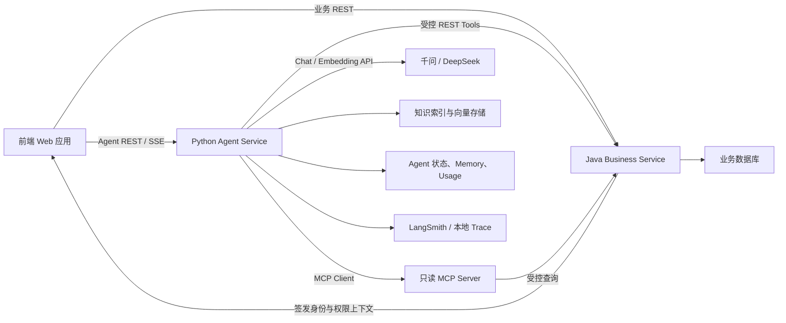

# 企业级项目蓝图：智维 Agent

## 1. 项目定义

项目名称：**智维 Agent——工业设备维护知识与工单协同平台**

项目目标：帮助设备维护人员快速检索手册和历史案例、补全故障信息、形成有证据的处理建议，并在人工审批后与企业工单系统协作。

它是一个企业级学习项目，不宣称达到真实航空航天或工业控制系统的认证标准。项目强调的是可迁移的企业 Agent 架构、业务闭环、稳定性和评测方法。

## 2. 项目边界

### 2.1 项目会做什么

- 管理租户、用户、角色、设备、告警、工单和审批；
- 摄取设备手册、维护规程、FAQ 和脱敏历史案例；
- 基于证据回答设备维护问题并提供引用；
- 从自然语言故障描述中提取结构化信息；
- 查询设备信息、历史告警和相关工单；
- 生成检查步骤与工单草稿；
- 对高风险或写操作发起人工审批；
- 追踪 Agent 路径、工具调用、延迟、Token 和费用；
- 使用固定评测集比较模型、Prompt、检索和图版本；
- 通过 REST 和 MCP 接入受控业务能力。

### 2.2 项目明确不做什么

- 不直接启动、停止或控制真实设备；
- 不把模型建议包装成经过认证的维修结论；
- 不让模型直接执行 SQL；
- 不让 Python Agent 绕过 Java 业务服务写业务数据库；
- 不暴露模型私密推理过程；
- 不把多 Agent 数量作为项目亮点；
- 不伪造千万级数据或高并发生产指标；
- 不在没有评测证据时声称“准确率很高”。

## 3. 用户角色

| 角色 | 主要需求 | 权限边界 |
| --- | --- | --- |
| 维护工程师 | 查手册、查历史、描述故障、生成工单草稿 | 只读设备信息，可创建草稿，不可直接批准高风险工单 |
| 维护主管 | 审查方案、编辑或批准工单 | 可批准授权范围内的工单 |
| 知识管理员 | 上传文档、管理版本、查看摄取状态 | 不自动获得工单审批权限 |
| 系统管理员 | 用户、角色、租户和系统配置 | 默认不可查看跨租户业务内容 |
| 审计人员 | 查看关键操作和 Agent Trace 摘要 | 只读，不可重新执行副作用工具 |

权限需要由业务服务验证，Prompt 中写“你没有权限”不能替代真实鉴权。

## 4. 核心业务流程

### 4.1 知识问答

```text
用户问题
  → 租户与权限验证
  → Query 规范化
  → 文档检索与重排
  → 证据充分性判断
  → 生成带引用回答或拒答
  → 记录检索、生成与反馈
```

### 4.2 故障协同

```text
故障描述
  → 结构化抽取
  → 缺失信息检查
  → 追问用户
  → 查询设备/告警/历史工单
  → 检索手册与维护规程
  → 风险规则节点
  → 生成检查建议
  → 输出证据、风险和不确定性
```

### 4.3 工单审批

```text
检查建议
  → 生成工单草稿
  → 确定性业务校验
  → LangGraph Interrupt
  → 主管批准 / 编辑 / 拒绝
  → 幂等提交 Java 业务服务
  → 返回工单号
  → 写入审计记录
```

拒绝后流程必须结束或回到明确的编辑状态，不能由模型寻找其他工具绕过审批。

## 5. 系统架构



### 5.1 前端 Web 应用

前端由学习者发挥既有能力完成，教程不讲框架基础，但规定需要呈现：

- Agent 执行进度，不显示私密思维链；
- 工具调用名称、授权状态和安全摘要；
- 引用来源与原文定位；
- 工单草稿差异；
- 批准、编辑、拒绝；
- 超时、失败、重试与恢复入口；
- Token/费用只在管理员或调试视图展示。

### 5.2 Python Agent Service

核心职责：

- Model Gateway 与供应商切换；
- Prompt、Context 与 Structured Output；
- LangChain Tool 与 Agent；
- RAG 摄取、检索、重排与引用；
- LangGraph 状态、Checkpoint、Interrupt 和恢复；
- Agent 级权限过滤与风险分类；
- Trace、Eval、Usage、单位任务成本和费用异常观测；
- REST/SSE API；
- Java REST Adapter 与 MCP Client。

Python 服务只把经过 Schema 校验的参数传递给业务服务，但最终业务合法性仍由 Java 验证。

### 5.3 Java Business Service

后期增强线职责：

- 租户、用户和角色；
- 设备与资产台账；
- 告警；
- 工单、工单状态和审批；
- 业务规则、事务、幂等与审计；
- 面向 Agent 的受控 REST API。

Java 不包含 Prompt、模型 SDK 或 LangGraph。这样做是为了明确：业务真相和 AI 决策不属于同一个稳定性域。

### 5.4 数据所有权

| 数据 | 所有者 | 本地开发 | 企业配置 |
| --- | --- | --- | --- |
| 用户/权限/设备/工单 | Java Service | H2 | MySQL/PostgreSQL |
| Agent Run/Tool 执行/Usage | Python Service | SQLite + SQLAlchemy | PostgreSQL + SQLAlchemy |
| LangGraph Checkpoint/Store | Python Service | SQLite Saver | PostgreSQL Saver/官方托管运行时 |
| 文档与 Chunk 元数据 | Python Service | SQLite/文件 | PostgreSQL/对象存储 |
| 向量索引 | Python Service | 嵌入式向量库 | pgvector/独立向量服务 |
| Trace | Python Service | JSON + LangSmith | LangSmith/OTel 后端 |
| API Usage | Python Service | SQLite | PostgreSQL/指标系统 |

不要求本地同时运行所有企业组件，但接口和配置边界必须保留。

## 6. Python 项目建议结构

```text
agent-service/
├── pyproject.toml
├── src/
│   └── app/
│       ├── api/                 # REST、SSE、错误契约
│       ├── core/                # 配置、日志、安全、执行边界
│       ├── models/              # Pydantic 数据契约
│       ├── llm/                 # ModelGateway 与 Provider Adapter
│       ├── prompts/             # 版本化 Prompt
│       ├── tools/               # Tool Schema、权限与 Adapter
│       ├── rag/                 # 摄取、检索、重排、引用
│       ├── graphs/              # LangGraph 状态与节点
│       ├── memory/              # Checkpoint 与长期记忆
│       ├── evals/               # 数据集、Evaluator、报告
│       ├── observability/       # Trace、Metrics、Usage
│       └── repositories/        # Agent 自有数据访问
├── tests/
│   ├── unit/
│   ├── integration/
│   ├── contract/
│   ├── evals/
│   └── security/
├── data/
│   ├── source-docs/
│   ├── golden-datasets/
│   └── fixtures/
└── docs/
    ├── adr/
    ├── eval-reports/
    └── runbooks/
```

目录会随学习逐步创建，不在第一周生成空壳大工程。

## 7. Java 项目建议结构

```text
business-service/
├── pom.xml
├── src/main/java/.../
│   ├── identity/
│   ├── asset/
│   ├── alert/
│   ├── workorder/
│   ├── approval/
│   ├── audit/
│   └── agentapi/                # 只暴露 Agent 允许使用的 API
├── src/main/resources/
│   ├── application-local.yml    # H2
│   └── application-prod.yml     # MySQL/PostgreSQL 参数
└── src/test/
```

只实现项目需要的最小业务能力，不在教程中扩展普通 Java 后端知识。

## 8. Tool 设计

### 8.1 只读工具

- `get_asset(asset_id)`：设备基础信息；
- `list_recent_alerts(asset_id, limit)`：近期告警；
- `search_work_orders(asset_id, keywords, limit)`：历史工单；
- `get_work_order(work_order_id)`：工单详情；
- `get_maintenance_window(asset_id)`：可维护时间窗；
- `search_knowledge(query, filters)`：知识检索。

### 8.2 有副作用工具

- `create_work_order_draft(...)`：只创建草稿；
- `submit_work_order(draft_id, approval_id, idempotency_key)`：审批后提交；
- `add_work_order_note(...)`：追加记录；
- `assign_work_order(...)`：高风险，需要审批或明确权限。

### 8.3 Tool 契约必须包含

- 用途与禁止用途；
- 参数 Schema 与字段约束；
- 所需权限；
- 是否有副作用；
- 是否允许重试；
- 超时；
- 可能错误；
- 审计级别；
- 输出 Schema；
- 幂等策略。

工具描述不是仅写给模型看的注释，而是 Agent 运行时的安全契约。

## 9. RAG 数据集

项目使用公开或合成数据，避免版权、隐私和行业机密问题。

建议构造：

- 10～20 份合成设备说明书；
- 5 份安全维护规程；
- 50～100 条脱敏或合成历史工单；
- 20 条错误码与排查规则；
- 多个版本相互冲突的文档，用于测试版本选择；
- 包含恶意指令的文档，用于测试间接 Prompt Injection；
- 无答案问题，用于拒答评测。

每个 Chunk 至少包含：

```text
tenant_id
document_id
document_version
section_path
page_or_paragraph
asset_type
effective_date
security_level
content_hash
```

## 10. Agent 状态设计

示意状态，不代表第一版一次性实现：

```text
thread_id
tenant_id
user_id
user_roles
task_id
user_messages
fault_report
missing_fields
asset_context
retrieved_evidence
risk_level
proposed_actions
work_order_draft
approval_status
executed_tool_ids
execution_limits
error_state
final_response
```

重要规则：

- API Key、数据库密码不进入 State；
- 大文档不直接进入 State，只保存引用；
- 权限上下文来自受信身份系统，不能由用户消息声明；
- 副作用工具执行 ID 必须持久化，支持重放去重；
- Memory 与当前任务 State 分开建模。

## 11. SSE 事件契约

前端展示安全进度事件，而不是模型思维链：

```text
run.started
input.required
retrieval.started
retrieval.completed
tool.approval_required
tool.started
tool.completed
tool.failed
response.delta
response.completed
run.failed
run.execution_limit_reached
```

每个事件包含 `event_id`、`run_id`、`timestamp` 和安全的结构化 Payload。敏感工具返回值在服务端保留，前端只显示摘要。

## 12. 评测体系

### 12.1 组件指标

| 组件 | 指标示例 |
| --- | --- |
| 结构化抽取 | Schema 合规率、字段准确率、缺失字段识别率 |
| Tool Calling | 工具选择正确率、参数正确率、越权调用数 |
| Retrieval | Recall@K、MRR、过滤正确率 |
| Generation | 引用正确率、忠实度、完整性、拒答正确率 |
| LangGraph | 路径正确率、恢复成功率、重复副作用数 |
| Safety | 注入成功数、越权成功数、敏感泄漏数 |
| System | 任务成功率、P95 延迟、单任务费用、失败率 |

### 12.2 初始验收目标

以下只是第一版工程目标，必须先跑 Baseline 再合理调整：

- 核心结构化输出 Schema 合规率 ≥ 95%；
- Tool 参数正确率 ≥ 90%；
- 核心知识集 Recall@5 ≥ 85%；
- 引用正确率 ≥ 90%；
- 应拒答问题的正确拒答率 ≥ 90%；
- 15 条安全攻击样例中，高风险未授权执行为 0；
- 重放/重复批准测试中，重复工单为 0；
- 超过最大步骤、Token 上限或 Deadline 的任务能够 100% 进入受控停止状态。

指标不能只跑一次；Prompt、模型、检索或图变更后必须回归。

## 13. 稳定性设计

### 13.1 超时

- 模型、Embedding、Java Tool 和 MCP Tool 分别设置超时；
- 总任务还要有独立 Deadline；
- 子调用剩余时间不能超过总 Deadline。

### 13.2 重试

- 只重试明确的瞬时错误；
- 使用指数退避与抖动；
- 写操作必须携带幂等键；
- Schema 错误的修复重试次数有限；
- 达到最大步骤、Token 上限或 Deadline 后禁止继续重试。

### 13.3 降级

- 强模型失败时可切换到低成本模型，但必须重新跑关键校验；
- LangSmith 不可用时写本地 Trace；
- Java 只读工具不可用时允许仅知识回答；
- 写工具不可用时只保留草稿，绝不假装提交成功；
- 检索证据不足时拒答或请求人工补充。

## 14. 安全设计

- 文档内容一律视为不可信数据；
- 模型输出一律通过 Schema 与业务规则校验；
- 工具按用户身份动态过滤；
- 读取和写入权限分离；
- 高风险写操作必须 Human-in-the-loop；
- Agent 不能自行修改审批结果；
- Tool 结果只返回任务需要的字段；
- Prompt、Trace 和日志进行敏感信息脱敏；
- 多租户检索必须在检索前过滤，不能生成后再过滤；
- 记录安全拒绝原因，但不向普通用户暴露防护细节。

## 15. 使用前自检与答案

### 自检 1：为什么项目不允许 Agent 直接控制真实设备？

答案：设备控制属于高风险物理副作用，需要独立安全系统、资质和严格验证。本课程聚焦知识辅助与受控工单协同。

### 自检 2：为什么 Java 是增强线而非主线？

答案：目标岗位核心是 Python Agent 生态；Java 用于展示与既有业务系统、事务边界的集成，不应分散 LangGraph、RAG 与评测学习时间。

对应资料：[西安“十五五”规划纲要](https://www.xa.gov.cn/gk/zcfg/xaszfwj/2044274527574188033.html)、[LangGraph Overview](https://docs.langchain.com/oss/python/langgraph/overview)、[OWASP GenAI](https://genai.owasp.org/)。

## 16. 分阶段演进

| 里程碑 | 新增能力 | 仍不引入 |
| --- | --- | --- |
| M0 | 模型网关、流式、Usage、错误 | Agent/RAG |
| M1 | 结构化输出、原生 Tool Loop | LangGraph/多 Agent |
| M2 | LangChain Agent、权限和可靠性 | 远程业务服务 |
| M3 | RAG、引用、拒答和评测 | Java/MCP |
| M4 | LangGraph、Memory、审批和恢复 | 复杂多 Agent |
| M5 | LangSmith、安全和费用观测 | 生产组件堆叠 |
| M6 | Java REST Tool、MCP、CI 配置 | 真实设备控制 |
| RC | 端到端评测、性能、文档和演示 | 新功能 |

## 17. 最终交付物

- 前端 Web 应用；
- Python Agent Service；
- 可选但推荐的 Java Business Service；
- 合成数据与文档生成说明；
- 单元、集成、契约、评测和安全测试；
- 评测报告；
- 架构图、数据模型和 API 文档；
- 至少 5 份 ADR；
- 至少 3 份故障复盘；
- 本地启动与企业部署说明；
- 5～8 分钟演示脚本；
- 面试项目深挖材料。

真正的项目亮点不是“用了很多框架”，而是能拿出证据说明：为什么这样拆、怎样防止错误、质量如何测、失败怎样恢复、费用如何控制、AI 如何安全地进入业务流程。
